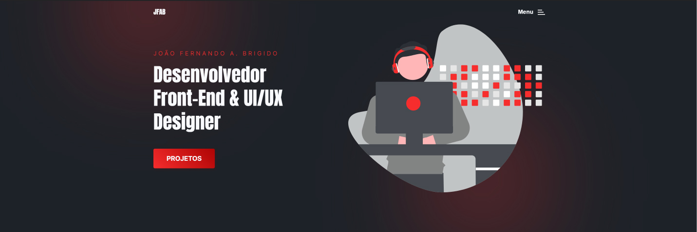
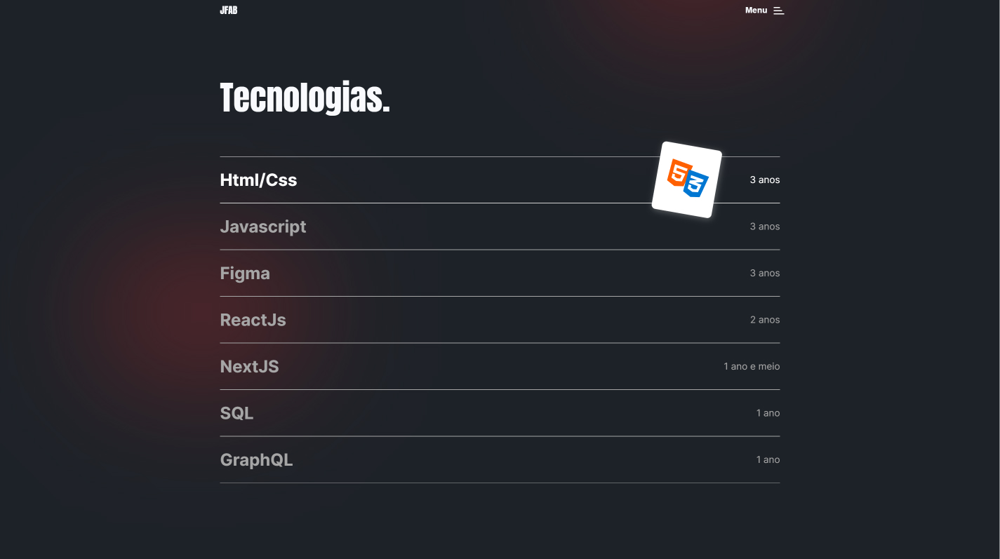
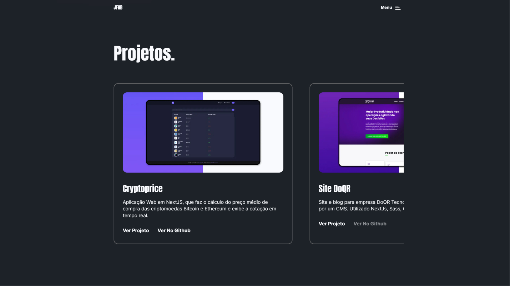
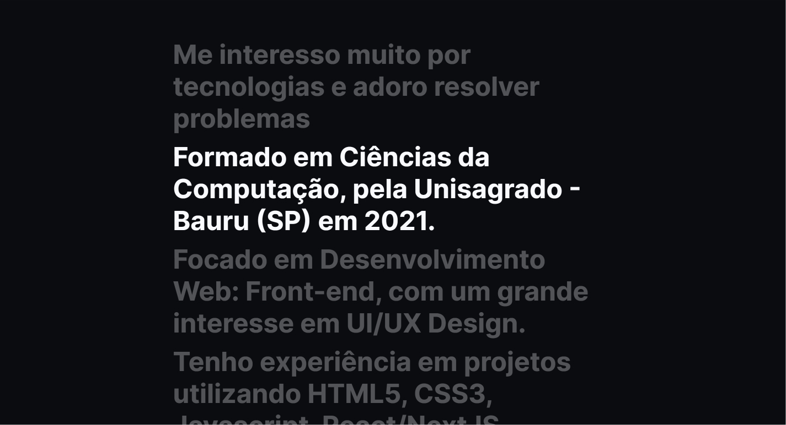
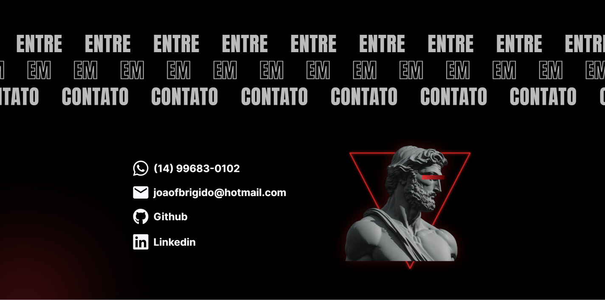

# Portfólio Pessoal

Site Portfólio com meus últimos projetos, principais tecnologias e contato. Acesse em: [joaobrigido.com.br](https://www.joaobrigido.com.br)

### Tecnologias utilizadas:

- Figma (UI/UX Design)
- NextJS
- React
- Sass
- Framer Motion

##

### Algumas imagens...

